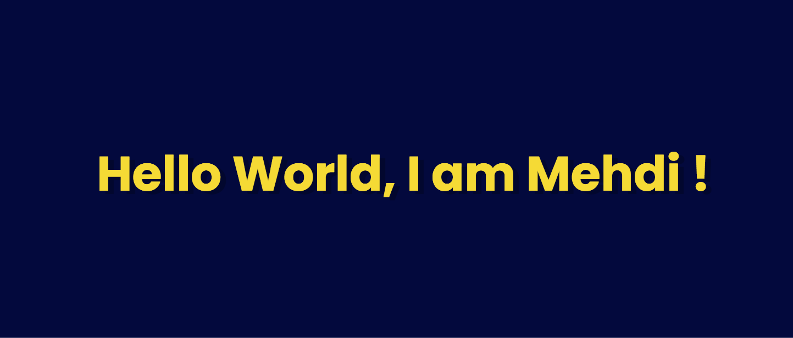

  
<br/>
  <h1 align="center">
     I am a Student and Developer ! 
  </h1>
<br/>

  - 👨🏽‍💻 I am a Full Stack Developer.
  - ⚡ I am Currently learning, working my skills in web development.
  - 📌 **I am currently contributing to the open source project [Mumble](https://github.com/divanov11/Mumble)**

<br/>
  
  <h1 align="center">Skills</h1>
    
    
    
    
    
    
    
<br/>
<br/>
<br/>
<br/>
  <h1 align="center">Tools</h1>
    
    
    
    
<br/>
<br/>
<br/>

<!--START_SECTION:waka-->
```text
No Activity tracked this Week
```
<!--END_SECTION:waka-->

<!--START_SECTION:activity-->
1. 🎉 Merged PR [#78](https://github.com/divanov11/mumbleapi/pull/78) in [divanov11/mumbleapi](https://github.com/divanov11/mumbleapi)
<!--END_SECTION:activity-->

